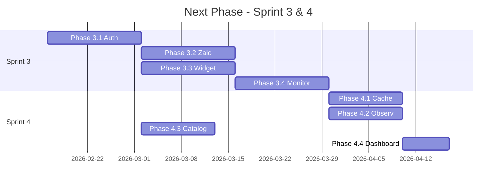

# KẾ HOẠCH TRIỂN KHAI GIAI ĐOẠN TIẾP THEO (Next Phase)

**Ngày lập**: 15/02/2026  
**Tham chiếu**: [ROADMAP.md](ROADMAP.md) | [DEVELOPMENT_PRIORITY.md](../knowledge/pages/DEVELOPMENT_PRIORITY.md) | [SIDEBAR_MAPPING_TABLE.md](../knowledge/pages/SIDEBAR_MAPPING_TABLE.md)  
**Mục tiêu**: Sẵn sàng production – Multi-channel deployment & vận hành thực tế tại thị trường VN

---

## 1. HIỆN TRẠNG (As-Is)

### 1.1 Backend ✅
| Thành phần | Trạng thái | Ghi chú |
|------------|------------|---------|
| Clean Architecture | ✅ | 4 layers, 100% async |
| Hybrid 3-Tier Orchestration | ✅ | Fast / Knowledge / Agentic Path |
| Multi-tenant | ✅ | tenant_id isolation |
| PostgreSQL + pgvector | ✅ | Semantic FAQ search |
| API Endpoints | ✅ | Catalog, Knowledge, Bots, Runtime, Logs |
| Zalo/Facebook Webhook | ⚠️ Skeleton | Có file, cần hoàn thiện |
| JWT Auth | ⚠️ Proposal | Chưa triển khai đầy đủ |
| Redis/Cache | ❌ | Chưa có |
| Message Queue | ❌ | Chưa có |
| Prometheus/Metrics | ❌ | Chưa có |

### 1.2 Frontend
| Trang | Path | Trạng thái | Ghi chú |
|-------|------|------------|---------|
| Dashboard | `/` | ⚠️ Basic | Cần số liệu thực |
| Monitor (Hội thoại) | `/monitor` | ⚠️ Basic | **Killer feature** – cần Live Chat + Handover |
| Catalog | `/catalog` | ⚠️ Basic | CRUD offerings chưa đủ |
| Knowledge | `/knowledge` | ⚠️ Basic | FAQ, Use Case, Comparison |
| Bots | `/bots` | ⚠️ Basic | Bot registry |
| Integrations | `/integrations` | ⚠️ Basic | Channel config |
| Tenants | `/tenants` | ⚠️ Basic | Tenant management |
| Studio | `/studio` | ⚠️ Basic | Test Bot |
| Analytics | `/analytics` | ⚠️ Basic | Metrics |
| Logs | `/logs` | ⚠️ Basic | Audit |
| Login/Settings | `/login`, `/settings` | ⚠️ Basic | Auth flow |

### 1.3 Gaps Ưu Tiên Cao (Vietnam Market Fit)
1. **Monitor + Human Handover** – Nhân viên sale cần nhảy vào chat khi Bot bí  
2. **Zalo OA Integration** – Kênh chính tại VN  
3. **Web Widget** – Chat trên website  
4. **Authentication** – Bảo vệ Admin Dashboard  
5. **Catalog đầy đủ** – CRUD Offering/Variant/Price/Inventory theo schema

---

## 2. PHẠM VI GIAI ĐOẠN TIẾP THEO

### Sprint 3: Integration & Operations (6–8 tuần)

**Mục tiêu**: Bot chạy thật trên Zalo + Web, nhân viên có thể monitor & handover.

#### 3.1 Phase 3.1 – Auth & Security (2 tuần)
| Task ID | Nội dung | Effort | Phụ thuộc |
|---------|----------|--------|-----------|
| A1 | Triển khai JWT Auth (login, middleware, refresh) | 3d | Auth proposal |
| A2 | RBAC cơ bản (Owner/Admin/Viewer) | 2d | A1 |
| A3 | Bảo vệ tất cả API endpoints | 1d | A1 |
| A4 | Frontend: Login flow, token storage, redirect | 2d | A1 |
| A5 | Frontend: Logout, session expiry handling | 0.5d | A4 |

**Deliverable**: Admin phải login trước khi vào Dashboard. API không gọi được nếu chưa auth.

---

#### 3.2 Phase 3.2 – Zalo OA Integration (2 tuần)
| Task ID | Nội dung | Effort | Phụ thuộc |
|---------|----------|--------|-----------|
| Z1 | Webhook endpoint: verify, nhận message | 2d | Zalo API docs |
| Z2 | Map Zalo user → runtime_session (tenant + bot) | 1d | Z1 |
| Z3 | Gửi reply qua Zalo API (text + template) | 1d | Z1 |
| Z4 | Rich message: quick reply, list, carousel | 1.5d | Z3 |
| Z5 | Integrations page: kết nối Zalo OA (App ID, Secret) | 1d | A1 |
| Z6 | End-to-end test: Chat Zalo → Bot trả lời | 1d | Z1–Z4 |

**Deliverable**: Khách chat trên Zalo OA nhận được phản hồi từ Bot. Admin cấu hình Zalo tại `/integrations`.

---

#### 3.3 Phase 3.3 – Web Widget SDK (2 tuần)
| Task ID | Nội dung | Effort | Phụ thuộc |
|---------|----------|--------|-----------|
| W1 | Widget SDK (JS): embed script, iframe/overlay | 2d | - |
| W2 | WebSocket / SSE kết nối chat real-time | 2d | Runtime API |
| W3 | Customizable theme (màu, logo, position) | 1d | W1 |
| W4 | Event tracking (open, message_sent, etc.) | 0.5d | W1 |
| W5 | Demo page: embed widget trên Next.js | 0.5d | W1 |

**Deliverable**: Website bất kỳ có thể embed chat widget. Chat real-time qua WebSocket/SSE.

---

#### 3.4 Phase 3.4 – Monitor & Human Handover (2 tuần) **[MUST HAVE]**
| Task ID | Nội dung | Effort | Phụ thuộc |
|---------|----------|--------|-----------|
| M1 | API: List sessions (filter: active, handover, closed) | 1d | - |
| M2 | API: Session detail + turns + context_slots | 1d | - |
| M3 | API: Handover (chuyển session từ bot → human) | 1d | runtime_session |
| M4 | Frontend: Live session list (polling hoặc SSE) | 1.5d | M1 |
| M5 | Frontend: Chat UI trong monitor (admin chat thay Bot) | 2d | M2, W2 |
| M6 | Frontend: Nút "Tiếp quản", cập nhật lifecycle_state | 1d | M3 |
| M7 | Gửi thông báo khách: "Nhân viên đang hỗ trợ bạn" | 0.5d | Z3, W2 |

**Deliverable**: Nhân viên xem danh sách session đang chat, click vào xem chi tiết, bấm "Tiếp quản" để chat trực tiếp thay Bot. Khách nhận thông báo khi chuyển sang human.

---

### Sprint 4: Production Infrastructure & Polish (4–6 tuần)

#### 4.1 Phase 4.1 – Caching & Performance (1.5 tuần)
| Task ID | Nội dung | Effort | Phụ thuộc |
|---------|----------|--------|-----------|
| C1 | Redis: Cài đặt, connection pool | 1d | - |
| C2 | Semantic cache → Redis (thay DB nếu cần) | 2d | C1 |
| C3 | Session state cache (giảm query DB) | 1d | C1 |
| C4 | Rate limiting (per tenant, per IP) | 1d | C1 |

---

#### 4.2 Phase 4.2 – Observability (1.5 tuần)
| Task ID | Nội dung | Effort | Phụ thuộc |
|---------|----------|--------|-----------|
| O1 | Prometheus metrics: request count, latency, tier distribution | 2d | - |
| O2 | Cost tracking per session (tokens, $) | 1d | runtime_decision_event |
| O3 | Grafana dashboard (basic) | 1d | O1 |
| O4 | Structured logging (JSON, trace_id) | 1d | - |

---

#### 4.3 Phase 4.3 – Catalog & Knowledge Polish (1.5 tuần)
| Task ID | Nội dung | Effort | Phụ thuộc |
|---------|----------|--------|-----------|
| P1 | Catalog: CRUD Offering + Version + Attributes | 2d | SCHEMA_DB |
| P2 | Catalog: Variant + Price + Inventory | 1.5d | P1 |
| P3 | Knowledge: FAQ CRUD + embedding generation | 1d | P1 |
| P4 | Knowledge: Use Case, Comparison CRUD | 1d | P1 |

---

#### 4.4 Phase 4.4 – Dashboard & Analytics (1 tuần)
| Task ID | Nội dung | Effort | Phụ thuộc |
|---------|----------|--------|-----------|
| D1 | Dashboard: Số session active, doanh thu ước tính | 1d | O2 |
| D2 | Dashboard: Chi phí Token, tỷ lệ tier | 1d | O2 |
| D3 | Analytics: Funnel, topic analysis | 2d | runtime_* |

---

## 3. THỨ TỰ TRIỂN KHAI ĐỀ XUẤT

**Song song có thể chạy**:
- 3.2 Zalo và 3.3 Widget (sau khi 3.1 Auth xong)
- 4.1 Cache và 4.2 Observability
- 4.3 Catalog có thể bắt đầu ngay sau 3.1 Auth

---

## 4. PHỤ THUỘC KỸ THUẬT

| Thành phần | Cần có | Ghi chú |
|------------|--------|---------|
| Zalo OA | App ID, App Secret | Đăng ký tại [Zalo Developers](https://developers.zalo.me/) |
| Facebook | Page Access Token | Graph API |
| Redis | Redis 6+ | Docker / Cloud |
| WebSocket | Backend hỗ trợ | FastAPI WebSocket hoặc SSE |

---

## 5. TIÊU CHÍ HOÀN THÀNH (Definition of Done)

### Sprint 3
- [ ] User login → JWT → gọi API thành công  
- [ ] Chat Zalo OA end-to-end (khách gửi → Bot trả lời)  
- [ ] Web Widget embed được, chat real-time  
- [ ] Monitor: List session, xem chat, Handover hoạt động  

### Sprint 4
- [ ] Redis cache hoạt động (semantic cache hoặc session)  
- [ ] Prometheus metrics + 1 Grafana dashboard  
- [ ] Catalog: CRUD Offering/Variant/Price đầy đủ  
- [ ] Dashboard: Hiển thị ít nhất 3 metric (sessions, cost, tier %)  

---

## 6. RỦI RO & GIẢM THIỂU

| Rủi ro | Mức | Giảm thiểu |
|--------|-----|------------|
| Zalo API thay đổi | Trung bình | Đọc kỹ docs, wrap trong adapter |
| WebSocket scale | Trung bình | Bắt đầu đơn giản, có thể chuyển Redis Pub/Sub sau |
| Thiếu nhân lực | Cao | Ưu tiên 3.1 + 3.4 (Auth + Monitor) trước |
| Latency Web Widget | Thấp | SSE thay WebSocket nếu đơn giản hơn |

---

## 7. TÀI LIỆU THAM KHẢO

- [ROADMAP.md](ROADMAP.md) – Technology roadmap  
- [DEVELOPMENT_PRIORITY.md](../knowledge/pages/DEVELOPMENT_PRIORITY.md) – Thứ tự trang  
- [PAGE_FEATURES.md](../knowledge/pages/PAGE_FEATURES.md) – Chi tiết tính năng từng trang  
- [authentication_proposal.md](../knowledge/authentication_proposal.md) – JWT flow  
- [SCHEMA_DB.MD](SCHEMA_DB.MD) – Database schema  
- [backend_architecture.md](backend_architecture.md) – Kiến trúc backend  

---

**Trạng thái**: DRAFT – Chờ phê duyệt  
**Cập nhật**: 15/02/2026
