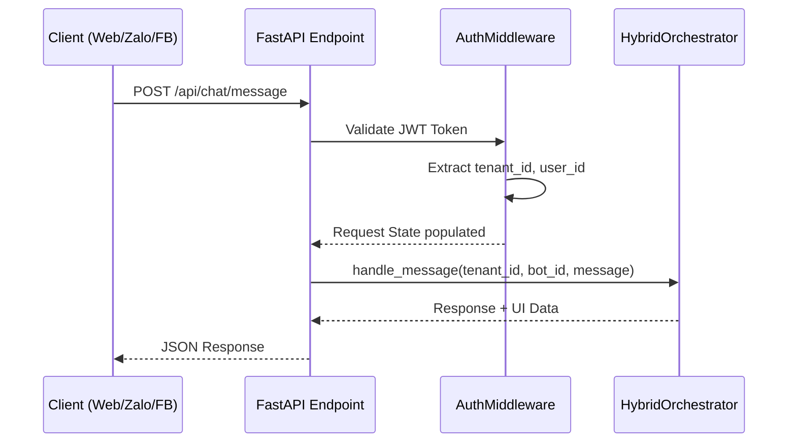
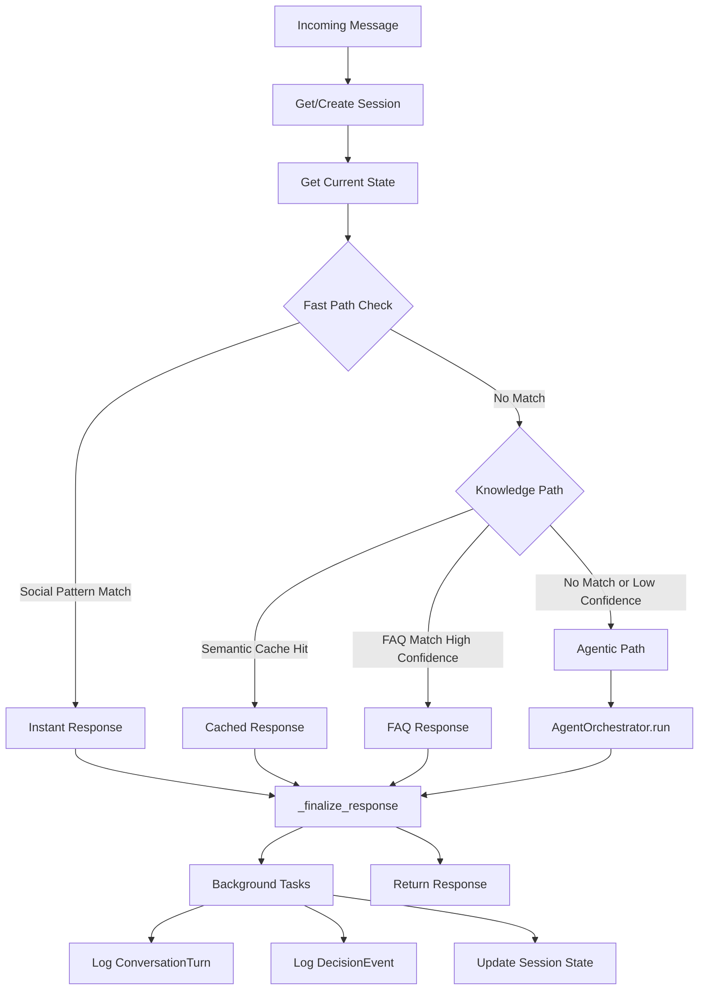
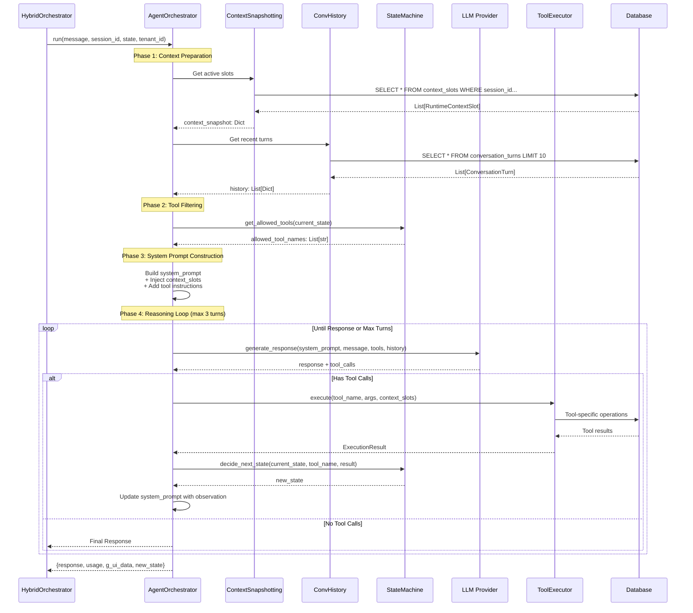
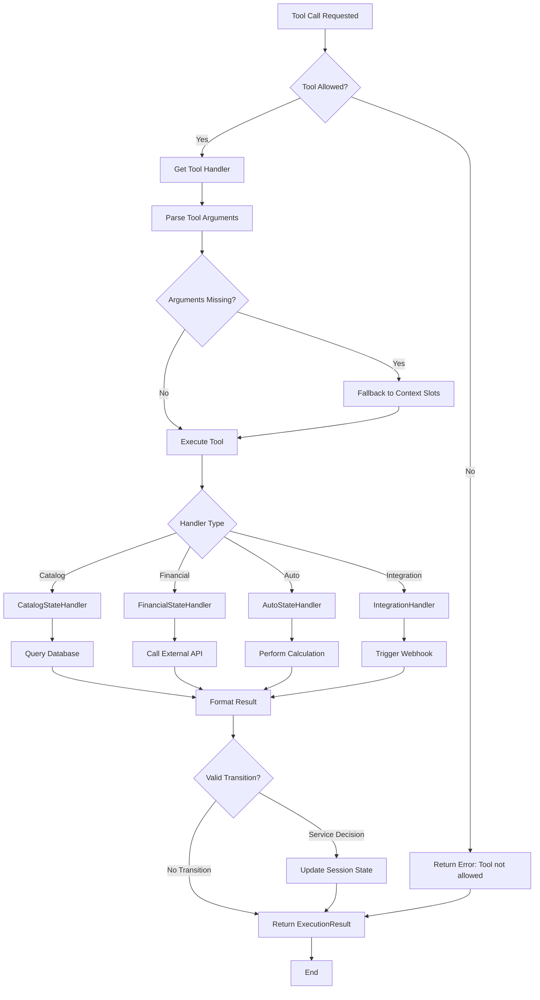
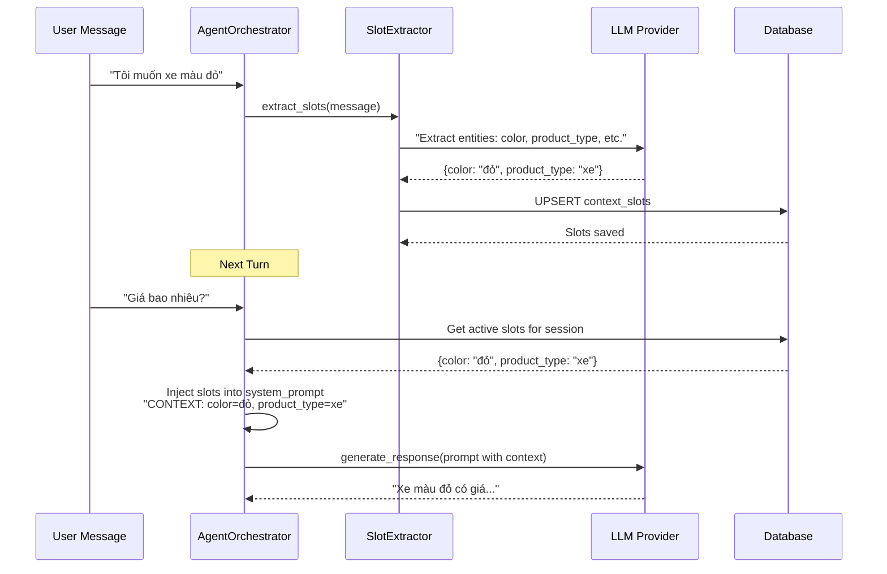

# System Flow

## Overview

Tài liệu này mô tả luồng xử lý chi tiết của Agentic Sales Platform từ khi nhận request đến khi trả response.

## High-Level Flow

```
Client Request
    ↓
[API Layer] FastAPI Endpoint
    ↓
[Middleware] Auth + Tenant Isolation
    ↓
[Orchestration] HybridOrchestrator
    ├→ [Tier 1] Fast Path (Regex) → Response
    ├→ [Tier 2] Knowledge Path (Cache/FAQ) → Response  
    └→ [Tier 3] Agentic Path → AgentOrchestrator → Response
    ↓
[Logging] Background Tasks (Decision, Turn, Analytics)
    ↓
Client Response
```

## Detailed Flows

### 1. Request Entry Flow



### 2. Hybrid Orchestration Flow



### 3. Agentic Processing Flow



### 4. Tool Execution Flow



### 5. Context Slot Management Flow



## Key Design Decisions

### 1. Why 3-Tier Processing?

**Cost Optimization**:
- Tier 1 (Fast Path): Xử lý ~30% requests với cost = $0
- Tier 2 (Knowledge): Xử lý ~40% requests với cost < $0.01
- Tier 3 (Agentic): Chỉ ~30% requests tốn cost cao

**Latency Optimization**:
- Fast Path: < 50ms (no network calls)
- Knowledge Path: < 500ms (local vector search)
- Agentic: Variable (AI reasoning)

### 2. Why Separate AgentOrchestrator?

**Separation of Concerns**:
- HybridOrchestrator: Routing logic (which tier?)
- AgentOrchestrator: Reasoning logic (how to reason?)

**Testability**:
- Có thể unit test Agent logic độc lập
- Mock LLM responses dễ dàng

### 3. Why State Machine?

**Safety**:
- Prevent invalid tool usage (e.g., không thể "purchase" khi chưa "view")
- Guided user journey

**Context Scoping**:
- Mỗi state có ý nghĩa business rõ ràng
- Tools được filter theo state để giảm token cost

### 4. Why Background Tasks?

**Performance**:
- Không block API response
- Logging diễn ra async

**Resilience**:
- Nếu logging fail, không ảnh hưởng user experience

## Performance Characteristics

### Latency Breakdown (P95)

| Tier | Latency | Components |
|------|---------|-----------|
| Fast Path | 10-50ms | Pattern matching + DB session lookup |
| Knowledge Path | 100-500ms | Vector search (pgvector) + Confidence scoring |
| Agentic Path | 1-5s | LLM inference (500-2000ms) + Tool execution (200-1000ms) + DB ops |

### Token Usage (Typical Conversation)

| Component | Tokens | Notes |
|-----------|--------|-------|
| System Prompt | 200-400 | Base instructions + domain knowledge |
| Context Slots | 50-100 | Injected user context |
| Conversation History | 300-800 | Last 10 turns (smart truncation) |
| Tool Definitions | 400-600 | Function calling schemas |
| User Message | 10-100 | Actual query |
| **Total Input** | **~1500** | Per agentic request |
| LLM Response | 100-300 | Natural language + function call |

---

**Documents Liên Quan**:
- [SIDEBAR_MAPPING_TABLE.md](../knowledge/pages/SIDEBAR_MAPPING_TABLE.md)
- [INTENT_USAGE_POLICY.md](../knowledge/INTENT_USAGE_POLICY.md)

**Flow Documentation**: Reflects production implementation  
**Last Updated**: February 2026
```
