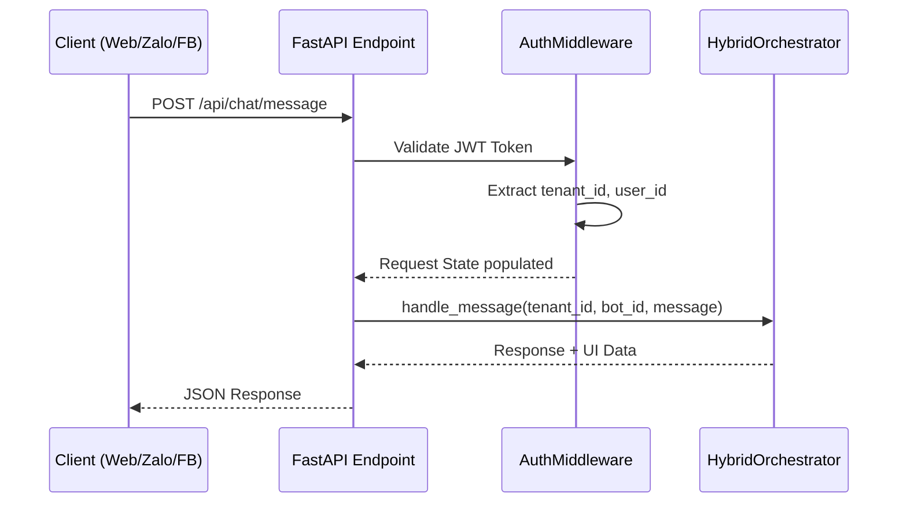
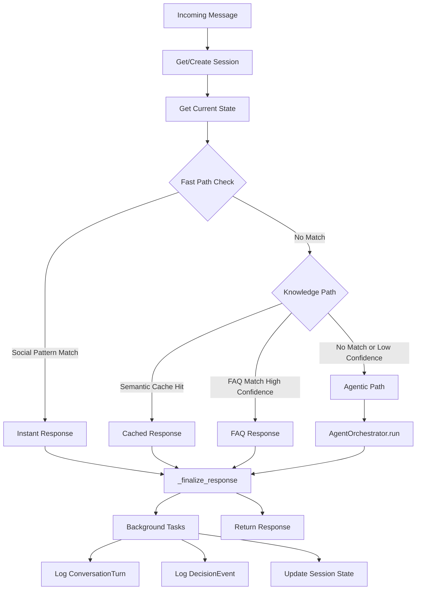
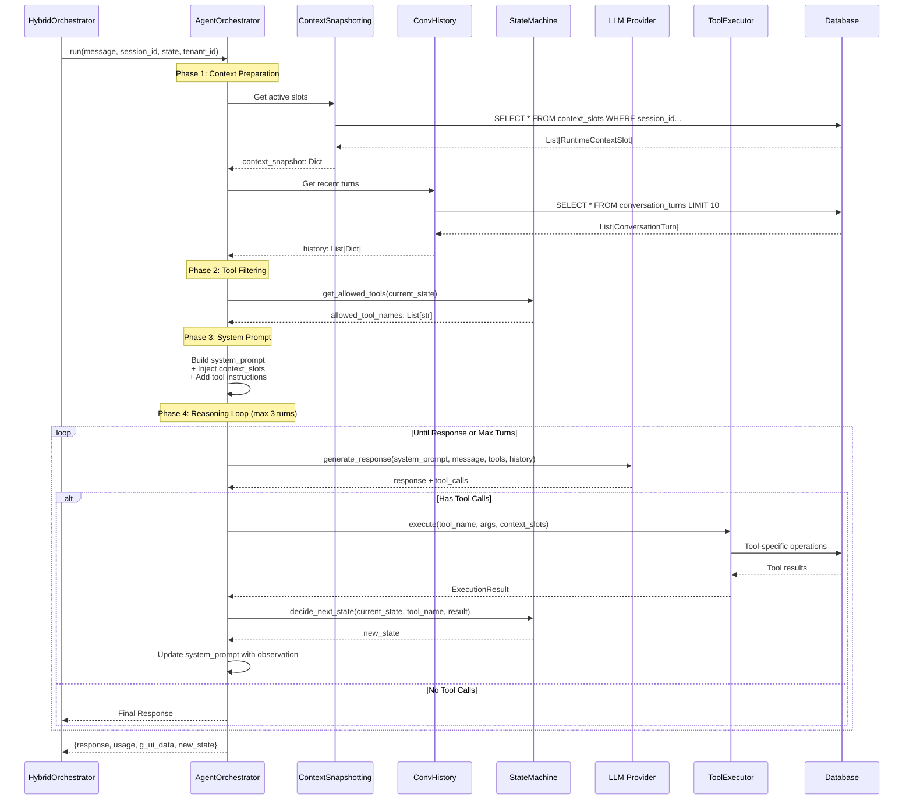
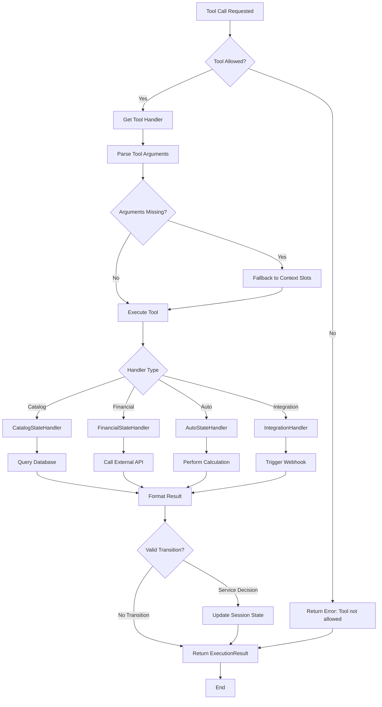
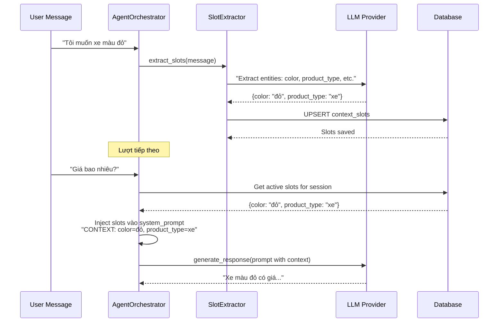

# Luồng Hệ Thống (System Flow)

## Tổng Quan

Tài liệu mô tả **luồng xử lý** chi tiết của Agentic Sales Platform từ khi nhận request đến khi trả response.

---

## Luồng Tổng Quan

```
Client Request
    ↓
[API Layer] FastAPI Endpoint
    ↓
[Middleware] Auth + Tenant Isolation
    ↓
[Orchestration] HybridOrchestrator
    ├→ [Tier 1] Fast Path (Regex) → Response
    ├→ [Tier 2] Knowledge Path (Cache/FAQ) → Response
    └→ [Tier 3] Agentic Path → AgentOrchestrator → Response
    ↓
[Logging] Background Tasks (Decision, Turn, Analytics)
    ↓
Client Response
```

=> **Điểm linh hoạt ăn tiền:** Hệ thống không "ném" mọi tin nhắn vào LLM. Tier 1 xử lý chào hỏi nhanh $0. Tier 2 trả FAQ/cache rẻ. Chỉ tin phức tạp mới vào Tier 3 - tiết kiệm token và chi phí.

---

## Luồng Chi Tiết

### 1. Luồng Vào Request



---

### 2. Luồng Điều Phối Hybrid



---

### 3. Luồng Xử Lý Agentic



---

### 4. Luồng Thực Thi Tool



---

### 5. Luồng Quản Lý Context Slots



=> **Điểm linh hoạt ăn tiền:** Khách không cần lặp lại "xe màu đỏ" mỗi câu. Bot nhớ qua slots. Hội thoại tự nhiên hơn, token ít hơn.

---

## Quyết Định Thiết Kế Chủ Chốt

### 1. Tại sao 3 Tier?

**Tối ưu chi phí**:
- Tier 1 (Fast Path): Xử lý ~30% request với cost = $0
- Tier 2 (Knowledge): ~40% với cost < $0.01
- Tier 3 (Agentic): Chỉ ~30% cost cao

**Tối ưu độ trễ**:
- Fast Path: < 50ms (không gọi mạng)
- Knowledge Path: < 500ms (vector search local)
- Agentic: Biến động (AI reasoning)

---

### 2. Tại sao tách AgentOrchestrator?

**Phân tách trách nhiệm**:
- HybridOrchestrator: Logic routing (tier nào?)
- AgentOrchestrator: Logic suy luận (suy luận thế nào?)

**Testability**:
- Test logic Agent độc lập
- Mock LLM dễ dàng

---

### 3. Tại sao State Machine?

**An toàn**:
- Ngăn dùng Tool sai (vd: không "purchase" khi chưa "view")
- Hành trình khách được dẫn dắt

**Giới hạn ngữ cảnh**:
- Mỗi state có ý nghĩa nghiệp vụ rõ
- Tool được filter theo state → giảm token

---

### 4. Tại sao Background Tasks?

**Hiệu năng**:
- Không block API response
- Logging chạy async

**Resilience**:
- Logging fail không ảnh hưởng trải nghiệm user

---

## Đặc Tính Hiệu Năng

### Độ trễ (P95)

| Tier | Latency | Thành phần |
|------|---------|------------|
| Fast Path | 10–50ms | Pattern matching + DB session lookup |
| Knowledge Path | 100–500ms | Vector search (pgvector) + confidence |
| Agentic Path | 1–5s | LLM inference (500–2000ms) + Tool (200–1000ms) + DB |

### Token dùng (hội thoại điển hình)

| Thành phần | Tokens | Ghi chú |
|------------|--------|---------|
| System Prompt | 200–400 | Base + domain knowledge |
| Context Slots | 50–100 | Context nhúng |
| Conversation History | 300–800 | 10 lượt gần nhất |
| Tool Definitions | 400–600 | Function calling schemas |
| User Message | 10–100 | Câu hỏi thực tế |
| **Tổng Input** | **~1500** | Mỗi request agentic |
| LLM Response | 100–300 | Text + function call |

---

**Tài liệu liên quan**:
- [SIDEBAR_MAPPING_TABLE.md](../knowledge/pages/SIDEBAR_MAPPING_TABLE.md)
- [INTENT_USAGE_POLICY.md](../knowledge/INTENT_USAGE_POLICY.md)

**Trạng thái Tài liệu**: Phản ánh triển khai hiện tại.
**Cập nhật lần cuối**: Tháng 02/2026.
