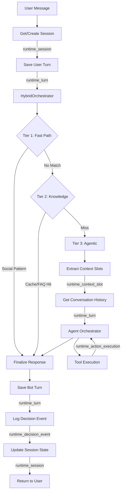

# Luồng Dữ Liệu Thời Chạy (Runtime Data Flow)

## Tổng Quan

Tài liệu mô tả **luồng dữ liệu thời chạy (runtime data flow)** trong Agentic Sales Platform - cách dữ liệu hội thoại chạy qua hệ thống và được lưu trữ trong các bảng `runtime_*`.

---

## Tổng Quan Bảng Runtime

Hệ thống dùng **6 bảng runtime** để:
- Theo dõi trạng thái phiên hội thoại
- Lưu lịch sử chat
- Trích xuất và lưu ngữ cảnh (context slots)
- Ghi audit quyết định của AI

| Bảng | Trạng thái | Mục đích |
|------|------------|----------|
| `runtime_session` | ✅ Active | Quản lý vòng đời phiên |
| `runtime_turn` | ✅ Active | Lịch sử hội thoại (tin nhắn user + bot) |
| `runtime_context_slot` | ✅ Active | Ngữ cảnh trích xuất (slots) theo phiên |
| `runtime_decision_event` | ✅ Active | Quyết định điều phối (tier nào dùng, cost, latency) |
| `runtime_action_execution` | ⚠️ Một phần | Log thực thi Tool |
| `runtime_guardrail_check` | 🔄 Kế hoạch | Kiểm tra an toàn (toxicity, PII) |

=> **Điểm linh hoạt ăn tiền:** Mọi quyết định của AI đều được ghi lại vào `runtime_decision_event`. Khi có sự cố, Admin có thể truy vết "Tại sao Bot chọn Agentic Path thay vì Cache?", "Phiên này tốn bao nhiêu token?" - đảm bảo **Audit Trail** 100%.

---

## Kiến Trúc Luồng Dữ Liệu

### Luồng Tổng Quan



---

## Chi Tiết Từng Bước

### 1. Quản Lý Phiên (runtime_session)

**Kích hoạt**: Tin nhắn đầu tiên hoặc lookup phiên hiện có

**Dữ liệu ghi**:
```python
{
    "id": "uuid",
    "tenant_id": "tenant-123",
    "bot_id": "bot-456",
    "lifecycle_state": "idle",  # idle, browsing, viewing, purchasing...
    "started_at": "2026-02-14T00:00:00",
    "ended_at": null,
    "ext_metadata": {}
}
```

**Thao tác**:
- `CREATE`: Phiên mới bắt đầu
- `UPDATE`: Chuyển trạng thái (`lifecycle_state` đổi)
- `READ`: Mỗi tin nhắn đều lấy trạng thái hiện tại

---

### 2. Lịch Sử Hội Thoại (runtime_turn)

**Kích hoạt**: Mỗi tin nhắn user và phản hồi bot

**Dữ liệu ghi**:

**User Turn**:
```python
{
    "session_id": "session-uuid",
    "speaker": "user",
    "message": "Tôi muốn mua laptop",
    "created_at": "2026-02-14T00:00:01",
    "ui_metadata": null
}
```

**Bot Turn**:
```python
{
    "session_id": "session-uuid",
    "speaker": "bot",  # Lưu trong DB; chuyển sang "assistant" khi gửi LLM
    "message": "Tôi tìm thấy 5 laptop phù hợp...",
    "created_at": "2026-02-14T00:00:03",
    "ui_metadata": {
        "type": "bento_grid",
        "offerings": [...]
    }
}
```

**Sử dụng**:
- Nhúng history vào LLM (10 turns gần nhất)
- Phát lại hội thoại trong Admin Dashboard
- Dữ liệu cho fine-tuning tương lai

---

### 3. Context Slots (runtime_context_slot)

**Kích hoạt**: Trích xuất slot sau tin nhắn user (Agentic Path)

**Dữ liệu ghi** (khớp `app/infrastructure/database/models/runtime.py`):
```python
{
    "session_id": "session-uuid",
    "key": "color",           # slot_key
    "value": "đỏ",            # slot_value
    "status": "active",        # active, overridden, conflict, inferred
    "source": "user",         # user, system, inferred
    "source_turn_id": "turn-123",  # turn trích xuất ra slot này
    "created_at": "2026-02-14T00:00:02"
}
# Ghi chú: confidence, expires_at — kế hoạch mở rộng, chưa triển khai
```

**Ví dụ theo ngành**:

| Ngành | Slot Keys | Giá trị mẫu |
|-------|-----------|-------------|
| **Bán lẻ** | color, size, brand, max_price | "đỏ", "L", "Nike", "5000000" |
| **Bất động sản** | bedrooms, location, budget, direction | "3", "Quận 1", "7 tỷ", "Đông Nam" |
| **Ô tô** | make, model, year, max_price | "Toyota", "Camry", "2020", "800 triệu" |
| **Tài chính** | loan_amount, income, purpose | "100 triệu", "30 triệu", "mua nhà" |

=> **Điểm linh hoạt ăn tiền:** Slots hoạt động như "Trí nhớ ngắn hạn". Khách nói "Laptop cho design" → slot `use_case=design`. Khách nói tiếp "Màu đen thôi" → thêm `color=đen`. Lần thứ 3 hỏi "Cái thứ 2 giá bao nhiêu?" → Bot dùng slots + kết quả tìm kiếm trước để giải quyết "thứ 2".

**Sử dụng**:
- Nhúng vào system prompt: `"CONTEXT: color=đỏ, budget=5tr"`
- Fallback cho tham số Tool: Thiếu `offering_id` thì lấy từ `context.get("offering_id")`
- Duy trì ngữ cảnh xuyên nhiều lượt chat

---

### 4. Sự Kiện Quyết Định (runtime_decision_event)

**Kích hoạt**: Sau mỗi quyết định điều phối (tier nào được dùng)

**Dữ liệu ghi** (khớp `app/infrastructure/database/models/decision.py`):
```python
{
    "session_id": "session-uuid",
    "input_turn_id": "turn-123",
    "bot_version_id": "bot-v-456",
    "tier_code": "agentic_path",      # fast_path, knowledge_path, agentic_path
    "decision_type": "PROCEED",       # ASK_CLARIFY, PROCEED, GUARDRAIL_BLOCK, FALLBACK...
    "decision_reason": "No cache hit, semantic search confidence 0.72",
    "estimated_cost": 0.015,
    "token_usage": {"prompt": 1500, "completion": 200},
    "latency_ms": 2340,
    "created_at": "2026-02-14T00:00:03"
}
```

**Phân tích**:
- Chi phí theo phiên
- Latency trung bình theo tier
- Phân bố tier (% Fast vs Knowledge vs Agentic)
- ROI: cost vs conversion

---

### 5. Thực Thi Hành Động (runtime_action_execution)

**Kích hoạt**: Khi Tool chạy trong Agentic Path

**Hiện trạng**: ⚠️ Một phần (log cơ bản)

**Dữ liệu ghi** (khớp `app/infrastructure/database/models/decision.py` — gắn với `decision_id`):
```python
{
    "decision_id": "decision-uuid",   # FK → runtime_decision_event
    "action_type": "trigger_tool",   # respond, call_api, trigger_tool
    "request_payload": {"tool": "search_offerings", "query": "laptop gaming"},
    "response_payload": {"success": true, "results_count": 5, "new_state": "browsing"},
    "status": "success",             # success, failed, timeout
    "started_at": "2026-02-14T00:00:02.5",
    "finished_at": "2026-02-14T00:00:02.95"
}
```

---

### 6. Kiểm Tra Guardrail (runtime_guardrail_check)

**Trạng thái**: 🔄 Kế hoạch (chưa triển khai)

**Mục đích**: Ghi log kiểm tra an toàn trước khi xử lý

**Schema dự kiến**:
```python
{
    "check_type": "toxicity" | "pii_detection" | "competitor_mention",
    "input_text": "User message",
    "check_result": "pass" | "fail",
    "confidence": 0.98,
    "action_taken": "allowed" | "blocked" | "flagged"
}
```

---

## Ví Dụ Luồng

### Ví dụ 1: Tra cứu Bán lẻ đơn giản

```
Khách: "Tôi muốn laptop giá rẻ"
```

**Thao tác DB**:
1. Session lookup/create (runtime_session)
2. Lưu User Turn (runtime_turn)
3. Tier chọn Agentic Path → Log Decision Event
4. Trích xuất slots: `product_type=laptop`, `price_preference=rẻ`
5. Tool search_offerings chạy
6. Lưu Bot Turn + cập nhật `lifecycle_state = browsing`

---

### Ví dụ 2: Hội thoại nhiều lượt với Context

```
Lượt 1: "Laptop cho design"  → Slots: {product_type: laptop, use_case: design}
Lượt 2: "Màu đen thôi"      → Slots: +{color: đen}
Lượt 3: "Cái thứ 2 giá bao nhiêu?" → Dùng slots + kết quả search trước để resolve "thứ 2"
```

---

## Đặc Tính Hiệu Năng

### Thao tác Ghi

| Bảng | Ghi mỗi tin nhắn | Batched? | Async? |
|------|------------------|----------|--------|
| `runtime_session` | 0–1 | Không | Không |
| `runtime_turn` | 2 (user + bot) | Không | Background |
| `runtime_context_slot` | 0–5 (TB 2) | Có | Background |
| `runtime_decision_event` | 1 | Không | Background |
| `runtime_action_execution` | 0–3 | Không | Background |

**Tổng ghi DB**: ~5–10 mỗi lượt hội thoại

=> **Tối ưu**: Phần lớn ghi chạy **background task** để không block API response.

---

### Thao tác Đọc

| Bảng | Đọc mỗi tin nhắn | Cache? |
|------|------------------|--------|
| `runtime_session` | 1 | Không |
| `runtime_turn` | 1 (LIMIT 10) | Dự kiến Redis |
| `runtime_context_slot` | 1 (status = active) | Không |

**Tổng đọc DB**: ~3 mỗi lượt hội thoại

---

## Hướng Phát Triển

### 1. Dọn dẹp phiên (Kế hoạch)
- Lên lịch archive phiên cũ (> 30 ngày)

### 2. Tóm tắt lượt chat (Nghiên cứu)
- Hội thoại > 50 lượt: tóm tắt lượt cũ thành slots, giữ 10 lượt gần nhất verbatim → giảm token

### 3. Dashboard phân tích thời gian thực
- Số phiên đang hoạt động
- Phân bố trạng thái
- Token usage, cost theo domain/bot

---

**Trạng thái Tài liệu**: Phản ánh triển khai hiện tại.
**Cập nhật lần cuối**: Tháng 02/2026.
**Vị trí**: `app/infrastructure/database/models/runtime.py`
