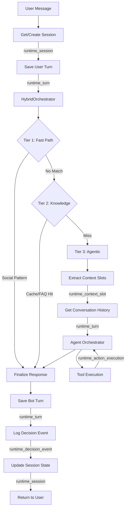

# Runtime Data Flow

## Overview

This document describes the **runtime data flow** in the Agentic Sales Platform - how conversation data flows through the system and gets persisted in the `runtime_*` tables.

---

## Runtime Tables Overview

The system uses **6 runtime tables** to track conversation state and execution:

| Table | Status | Purpose |
|-------|--------|---------|
| `runtime_session` | ✅ Active | Session lifecycle management |
| `runtime_turn` | ✅ Active | Conversation history (user + bot messages) |
| `runtime_context_slot` | ✅ Active | Extracted context (slots) per session |
| `runtime_decision_event` | ✅ Active | Orchestration decisions (which tier used, cost, latency) |
| `runtime_action_execution` | ⚠️ Partially Used | Tool execution logging |
| `runtime_guardrail_check` | 🔄 Planned | Safety checks (toxicity, PII detection) |

---

## Data Flow Architecture

### High-Level Flow



---

## Detailed Flow Breakdown

### 1. Session Management (runtime_session)

**Trigger**: First message in conversation or session lookup

**Data Written**:
```python
{
    "id": "uuid",
    "tenant_id": "tenant-123",
    "bot_id": "bot-456",
    "flow_step": "idle",  # Lifecycle state
    "started_at": "2026-02-14T00:00:00",
    "ended_at": null,
    "metadata": {}
}
```

**Operations**:
- `CREATE`: New conversation starts
- `UPDATE`: State transitions (`flow_step` changes)
- `READ`: Every message retrieves current state

---

### 2. Conversation History (runtime_turn)

**Trigger**: Every user message and bot response

**Data Written**:

**User Turn**:
```python
{
    "session_id": "session-uuid",
    "speaker": "user",
    "message": "Tôi muốn mua laptop",
    "created_at": "2026-02-14T00:00:01",
    "ui_metadata": null
}
```

**Bot Turn**:
```python
{
    "session_id": "session-uuid",
    "speaker": "assistant",
    "message": "Tôi tìm thấy 5 laptop phù hợp...",
    "created_at": "2026-02-14T00:00:03",
    "ui_metadata": {
        "type": "bento_grid",
        "offerings": [...]
    }
}
```

**Usage**:
- History injection into LLM (last 10 turns)
- Conversation replay in admin dashboard
- Training data for future fine-tuning

---

### 3. Context Slots (runtime_context_slot)

**Trigger**: Slot extraction after user message (Agentic Path)

**Data Written**:
```python
{
    "session_id": "session-uuid",
    "slot_key": "color",
    "slot_value": "đỏ",
    "confidence": 0.95,
    "extracted_from_turn_id": "turn-123",
    "created_at": "2026-02-14T00:00:02",
    "expires_at": "2026-02-14T01:00:02"  # TTL
}
```

**Examples by Domain**:

| Domain | Slot Keys | Example Values |
|--------|-----------|----------------|
| **Retail** | color, size, brand, max_price | "đỏ", "L", "Nike", "5000000" |
| **Real Estate** | bedrooms, location, budget, direction | "3", "Quận 1", "7000000000", "Đông Nam" |
| **Auto** | make, model, year, max_price | "Toyota", "Camry", "2020", "800000000" |
| **Finance** | loan_amount, income, purpose | "100000000", "30000000", "mua nhà" |

**Usage**:
- Injected into system prompt: `"CONTEXT: color=đỏ, budget=5tr"`
- Tool argument fallback: If `offering_id` missing from LLM call, use `context.get("offering_id")`
- Multi-turn context persistence

---

### 4. Decision Events (runtime_decision_event)

**Trigger**: After each orchestrator decision (which tier was used)

**Data Written**:
```python
{
    "session_id": "session-uuid",
    "event_type": "tier_selection",  # or "tool_execution", "state_transition"
    "decision_metadata": {
        "tier": "agentic_path",
        "reason": "No cache hit, semantic search confidence 0.72",
        "alternative_considered": "knowledge_path"
    },
    "estimated_cost_usd": 0.015,  # LLM API cost
    "latency_ms": 2340,
    "created_at": "2026-02-14T00:00:03"
}
```

**Analytics Use Cases**:
- Cost tracking per session
- Average latency per tier
- Tier distribution (% Fast vs Knowledge vs Agentic)
- ROI calculation (cost vs conversion)

---

### 5. Action Execution (runtime_action_execution)

**Trigger**: Tool execution in Agentic Path

**Current Status**: ⚠️ Partially implemented (basic logging)

**Data Written**:
```python
{
    "session_id": "session-uuid",
    "action_type": "tool_call",
    "action_name": "search_offerings",
    "input_params": {
        "query": "laptop gaming",
        "max_price": "30000000"
    },
    "output_result": {
        "success": true,
        "results_count": 5,
        "new_state": "browsing"
    },
    "execution_time_ms": 450,
    "created_at": "2026-02-14T00:00:02.5"
}
```

**Future Enhancements**:
- Detailed tool call chain visualization
- Performance profiling per tool
- Error rate tracking

---

### 6. Guardrail Checks (runtime_guardrail_check)

**Status**: 🔄 Planned (not yet implemented)

**Purpose**: Log safety checks before processing

**Planned Schema**:
```python
{
    "session_id": "session-uuid",
    "check_type": "toxicity" | "pii_detection" | "competitor_mention",
    "input_text": "User message",
    "check_result": "pass" | "fail",
    "confidence": 0.98,
    "action_taken": "allowed" | "blocked" | "flagged"
}
```

---

## Data Flow Examples

### Example 1: Simple Retail Query

```
User: "Tôi muốn laptop giá rẻ"
```

**Database Operations**:

1. **Session Lookup/Create**:
```sql
INSERT INTO runtime_session (id, tenant_id, bot_id, flow_step, started_at)
VALUES ('sess-1', 'tenant-1', 'bot-1', 'idle', NOW());
```

2. **Save User Turn**:
```sql
INSERT INTO runtime_turn (session_id, speaker, message, created_at)
VALUES ('sess-1', 'user', 'Tôi muốn laptop giá rẻ', NOW());
```

3. **Tier Selection → Agentic Path**:
```sql
INSERT INTO runtime_decision_event (session_id, event_type, decision_metadata)
VALUES ('sess-1', 'tier_selection', '{"tier": "agentic_path"}');
```

4. **Slot Extraction**:
```sql
INSERT INTO runtime_context_slot (session_id, slot_key, slot_value, confidence)
VALUES ('sess-1', 'product_type', 'laptop', 0.95),
       ('sess-1', 'price_preference', 'rẻ', 0.88);
```

5. **Tool Execution**:
```sql
-- (Simplified, actual execution happens in code)
INSERT INTO runtime_action_execution (session_id, action_name, input_params)
VALUES ('sess-1', 'search_offerings', '{"query": "laptop", "price_range": "low"}');
```

6. **Save Bot Turn**:
```sql
INSERT INTO runtime_turn (session_id, speaker, message, ui_metadata)
VALUES ('sess-1', 'assistant', 'Tôi tìm thấy 5 laptop...', '{"type": "grid"}');
```

7. **Update Session State**:
```sql
UPDATE runtime_session SET flow_step = 'browsing' WHERE id = 'sess-1';
```

---

### Example 2: Multi-Turn with Context

```
Turn 1
User: "Laptop cho design"
→ Slots: {product_type: laptop, use_case: design}

Turn 2
User: "Màu đen thôi"
→ Slots: {color: đen}  (adds to existing)

Turn 3
User: "Cái thứ 2 giá bao nhiêu?"
→ Uses slots: product_type, color
→ Resolves ordinal "thứ 2" from previous search results
```

**Context Slot Accumulation**:
```sql
-- Turn 1
INSERT INTO runtime_context_slot (session_id, slot_key, slot_value)
VALUES ('sess-1', 'product_type', 'laptop'),
       ('sess-1', 'use_case', 'design');

-- Turn 2 (add new slot)
INSERT INTO runtime_context_slot (session_id, slot_key, slot_value)
VALUES ('sess-1', 'color', 'đen');

-- Turn 3 (read existing slots)
SELECT slot_key, slot_value FROM runtime_context_slot
WHERE session_id = 'sess-1' AND expires_at > NOW();
-- Returns: {product_type: laptop, use_case: design, color: đen}
```

---

## Performance Characteristics

### Write Operations

| Table | Writes per Message | Batched? | Async? |
|-------|-------------------|----------|--------|
| `runtime_session` | 0-1 (create once) | No | No |
| `runtime_turn` | 2 (user + bot) | No | Background task |
| `runtime_context_slot` | 0-5 (avg 2) | Yes | Background task |
| `runtime_decision_event` | 1 | No | Background task |
| `runtime_action_execution` | 0-3 (if agentic) | No | Background task |

**Total DB Writes**: ~5-10 per conversation turn

**Optimization**: Most writes happen in **background tasks** to not block API response.

---

### Read Operations

| Table | Reads per Message | Cached? |
|-------|------------------|---------|
| `runtime_session` | 1 | No (but scoped to session_id) |
| `runtime_turn` | 1 (LIMIT 10) | Planned (Redis) |
| `runtime_context_slot` | 1 (where expires_at > NOW) | No |

**Total DB Reads**: ~3 per conversation turn

---

## Monitoring & Analytics

### Key Metrics from Runtime Tables

**From `runtime_decision_event`**:
```sql
-- Cost per session
SELECT session_id, SUM(estimated_cost_usd) as total_cost
FROM runtime_decision_event
GROUP BY session_id;

-- Tier distribution
SELECT decision_metadata->>'tier' as tier, COUNT(*) as count
FROM runtime_decision_event
GROUP BY tier;
```

**From `runtime_turn`**:
```sql
-- Average conversation length
SELECT session_id, COUNT(*) / 2 as turns  -- Divide by 2 (user+bot pairs)
FROM runtime_turn
GROUP BY session_id;
```

**From `runtime_context_slot`**:
```sql
-- Most common extracted slots
SELECT slot_key, COUNT(*) as frequency
FROM runtime_context_slot
GROUP BY slot_key
ORDER BY frequency DESC;
```

---

## Future Enhancements

### 1. Session Cleanup (Planned)
```python
# Scheduled job
async def archive_old_sessions():
    cutoff = datetime.now() - timedelta(days=30)
    await db.execute(
        update(RuntimeSession)
        .where(RuntimeSession.ended_at < cutoff)
        .values(archived=True)
    )
```

### 2. Turn Summarization (Research)
For long conversations (> 50 turns):
- Summarize old turns into context slots
- Keep recent 10 turns verbatim
- Reduces token cost while preserving context

### 3. Real-Time Analytics Dashboard
- Live session count
- Active states distribution
- Token usage trending
- Cost per domain/bot

---

**Implementation Status**: Core tables active, analytics layer growing  
**Last Updated**: February 2026  
**Location**: `app/infrastructure/database/models/runtime.py`