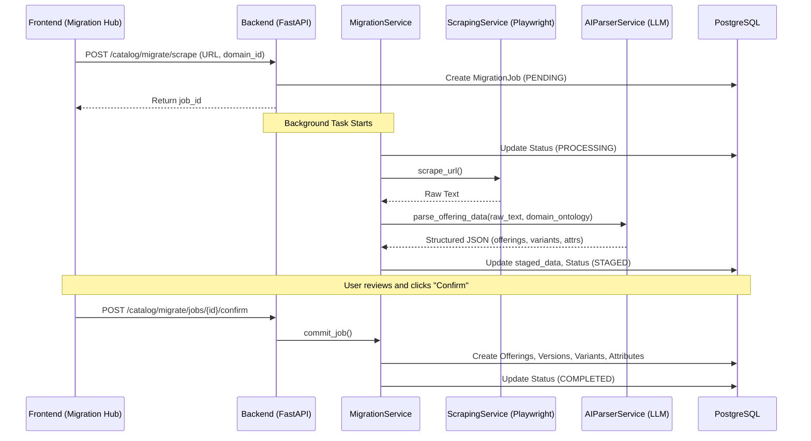

# Migration Hub Technical Guide

This document explains the architecture of the Migration Hub, the role of AI (LLM) in parsing, and how to extend the system for new websites.

## 1. Architecture Overview

The Migration Hub follows a **Staged Import** pattern:
1.  **Creation**: A `MigrationJob` is created with a source (URL/File) and a target (Bot/Domain).
2.  **Scraping**: `ScrapingService` uses Playwright to fetch the raw text content of a webpage.
3.  **Parsing (AI)**: `AIParserService` uses an LLM to transform raw text into a structured JSON schema.
4.  **Staging**: The data is saved in the `staged_data` field of the `MigrationJob` for user review.
5.  **Commit**: Once approved, `MigrationService` pushes the JSON data vào Catalog (`TenantOffering`, `TenantOfferingVersion`, `TenantOfferingVariant`).

## 2. Process Flow

## 3. When is the LLM used?

The LLM is used in the **Parsing** stage (`AIParserService`). 

### Why LLM?
Traditional scrapers require custom regex or CSS selectors for every single website. Our system uses a **Generic AI Parser**:
- It takes the **Raw text** (innerText) of any page.
- It is guided by the **Domain Ontology** (e.g., if the domain is "Jewelry", it is told to look for "Material", "Carat", "Weight").
- It handles inconsistencies in website layouts automatically.

### LLM Prompting
The LLM is prompted via `AIParserService.parse_offering_data`. It converts the messy text into a strict JSON schema:
- **Offerings**: Name, Code, Description (thống nhất product = offering).
- **Attributes**: Key-Value pairs mapped to the Ontology.
- **Variants**: SKU, Name, Price.

## 4. How to Crawl Other Sites

Since we use a **General AI Parser**, you don't usually need to write new code for new sites! 

### Strategy A: Zero-Code (Recommended)
Just enter the URL of the new site in the Migration Hub. 
- The `ScrapingService` will fetch the text.
- The LLM will use its general knowledge to find the product name, price, and specs.

### Strategy B: Improving Results for a Specific Site
If a site has very complex dynamic content or high anti-bot protection:
1.  **Selectors**: Update `test_playwright.py` or `ScrapingService` to handle specific selectors if `innerText` is not enough.
2.  **Wait times**: Some sites (SPAs) need more time to load. Adjust `await asyncio.sleep(2)` in `ScrapingService`.
3.  **User Agent**: Use high-quality User-Agents to avoid blocks.

### Strategy C: Adding New Providers
If you want to migrate from an API (e.g., Shopify API) rather than scraping:
1.  Create a new class in `app/core/services/migration_providers.py` inheriting from `BaseMigrationProvider`.
2.  Implement `fetch_and_parse`.
3.  Register it in `MigrationService.__init__`.

---
**Tip**: Use `test_playwright.py` to debug how a specific site looks to the system before starting a real migration job.
