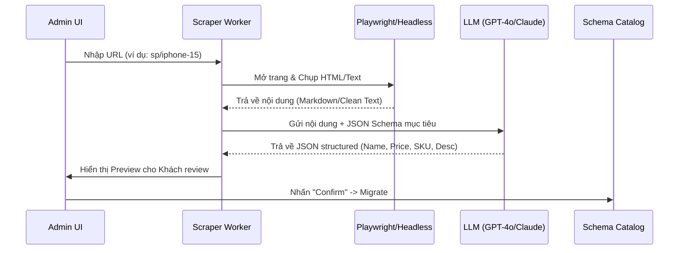

# Hướng dẫn Kỹ thuật: Web Scraper "AI-First" cho Catalog Migration

Phương pháp cào dữ liệu truyền thống (dùng CSS Selector) rất dễ lỗi khi Website khách hàng thay đổi giao diện. Với **AI Hub**, tôi tư vấn bạn dùng hướng **AI Scraper** - sử dụng LLM để hiểu nội dung trang web thay vì lập trình cứng.

---

## 1. Kiến trúc hệ thống Scraper



---

## 2. Công cụ khuyên dùng

### A. Tầng Fetching (Lấy dữ liệu thô)
- **Playwright (Python/Node.js)**: Tốt nhất để xử lý các trang web hiện đại dùng React/Next.js (SPA). Nó có thể giả lập cuộn trang để tải đủ ảnh.
- **Firecrawl**: Một service mới nổi cực kỳ mạnh mẽ, tự động chuyển đổi toàn bộ Website thành Markdown gọn sạch cho LLM đọc.

### B. Tầng Trí tuệ (Bóc tách dữ liệu)
- **Model**: Dùng `gpt-4o-mini` hoặc `gemini-1.5-flash` để tối ưu chi phí.
- **Prompt Strategy**: Cung cấp cho AI danh sách các `AttributeDefinition` bạn đang có để nó tự map.
    *   *Ví dụ Prompt:* "Hãy đọc nội dung này và chuyển thành JSON theo Schema sau. Nếu thấy HDSD, hãy map vào attribute 'manual_instruction'."

---

## 3. Cách AI giúp xử lý dữ liệu phức tạp

Một trang Web thường có rất nhiều rác (Menu, Footer, Quảng cáo). AI sẽ giúp:
1.  **Lọc nhiễu**: Chỉ tập trung vào thẻ `product-detail`.
2.  **Đồng nhất đơn vị**: Tự quy đổi "2.5 triệu" thành `2500000` và `VND`.
3.  **Tự tạo SKU**: Nếu trang web có các option màu sắc/dung lượng, AI có thể tự sinh ra danh sách `ProductVariant` gợi ý cho bạn.

---

## 4. Lộ trình triển khai (MVP)

1.  **Giai đoạn 1 (Single Page)**: Cho phép khách dán 1 link sản phẩm -> Hiện Preview -> Lưu vào Hub.
2.  **Giai đoạn 2 (Automation)**: Nhập link **Sitemap.xml** hoặc danh mục sản phẩm -> Hệ thống tự động xếp hàng (Queue) cào 100-200 sản phẩm cùng lúc trong background.
3.  **Giai đoạn 3 (Auto-Sync)**: Định kỳ 1 tuần Web Scraper quay lại link đó, nếu thấy giá thay đổi thì báo cho Admin Hub biết để cập nhật (Price Tracking).

---

## 5. Ví dụ Dữ liệu đầu ra của Scraper

```json
{
  "product": {
    "code": "IPHONE-15-PRO",
    "name": "iPhone 15 Pro 128GB",
    "description": "Chip A17 Pro mạnh mẽ, vỏ Titan siêu bền...",
    "status": "draft"
  },
  "variants": [
    { "sku": "IP15P-128-TITAN", "name": "Màu Titan Tự Nhiên", "price": 28990000 },
    { "sku": "IP15P-128-BLUE", "name": "Màu Xanh Titan", "price": 28990000 }
  ],
  "attributes": {
    "screen_size": "6.1 inch",
    "chip": "A17 Pro",
    "camera": "48MP"
  }
}
```

**Cách tiếp cận này sẽ giúp Hub của bạn "thông minh" hơn hẳn các Chatbot thông thường vì nó sở hữu dữ liệu thực tế từ hệ thống bán hàng của khách.** 

Bạn muốn tôi thử demo một đoạn mã Python sử dụng Playwright để lấy dữ liệu thô không?
