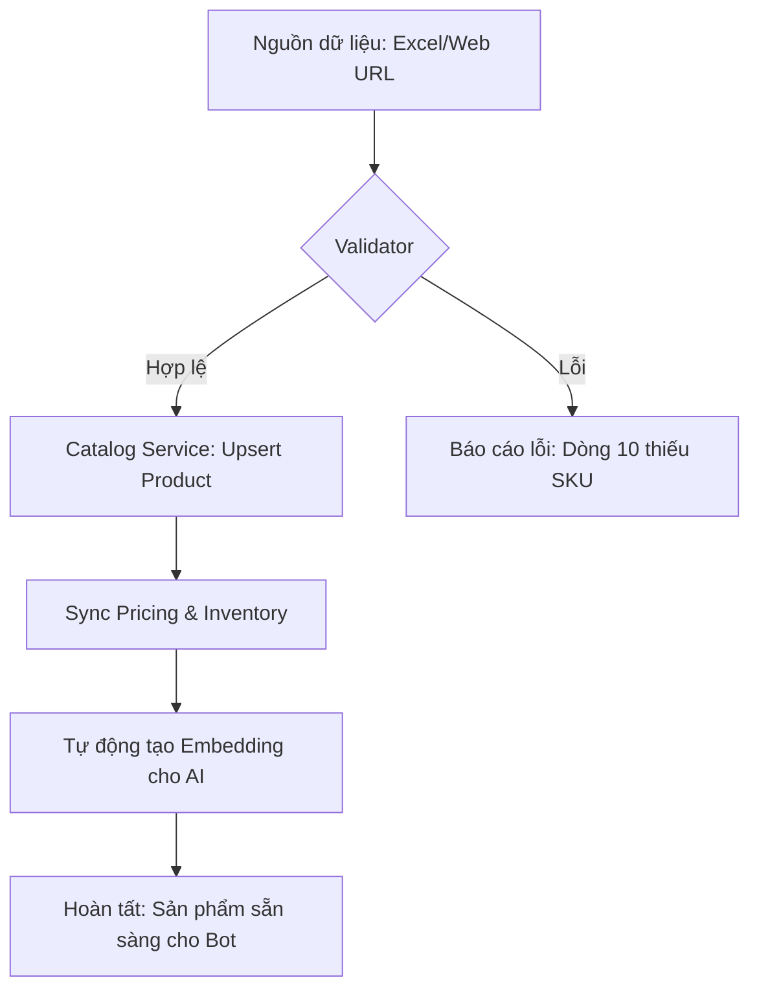

# Tư vấn triển khai tính năng Migration (Nhập dữ liệu hàng loạt)

Đúng như bạn nhận định, việc tạo từng sản phẩm thủ công chỉ dành cho tinh chỉnh. Trong thực tế, khách hàng sẽ cần đưa hàng nghìn sản phẩm vào Bot một cách nhanh chóng. Dựa trên schema hiện tại, đây là lộ trình tôi tư vấn cho bạn:

---

## 1. Cơ chế "Bulk Upsert" (Cập nhật hoặc Tạo mới)
Thay vì dùng API `POST` cho từng cái, bạn nên xây dựng một API `POST /catalog/migrate` nhận một mảng (Array) dữ liệu.

**Logic xử lý tại Backend:**
- **Identifier**: Dùng `code` làm key chính cho Product và `sku` cho Variant.
- **Upsert**: 
    - Nếu `code` đã tồn tại: Cập nhật thông tin (hoặc tạo Version mới nếu có thay đổi lớn).
    - Nếu `code` chưa có: Tạo mới Product + Version 1 + Variants + Prices.
- **Transaction**: Xử lý theo từng cụm (batch) để đảm bảo nếu một sản phẩm lỗi thì không làm chết toàn bộ quá trình, nhưng vẫn đảm bảo tính toàn vẹn dữ liệu của từng sản phẩm.

---

## 2. Các nguồn Migration thực tế (Sources)

### A. Web Scrapper (Ưu tiên cao cho AI Hub)
Khách hàng thường đã có Website bán hàng (Haravan, Shopify, hoặc Web tự làm).
- **Tính năng**: Cho phép khách nhập URL trang sản phẩm hoặc Sitemap.
- **Xử lý**: Dùng một service (như Playwright hoặc Firecrawl) để cào dữ liệu: Tên, Mô tả, Giá, Ảnh.
- **AI Tool**: Dùng LLM để "đọc" nội dung cào được và map vào các `ProductAttribute` (ví dụ: tự bóc tách chất liệu, hướng dẫn sử dụng từ mô tả text).

### B. Excel/CSV Import
Đây là cách "cổ điển" nhưng cực kỳ hiệu quả cho dữ liệu ERP/Kho.
- **Template**: Cung cấp một tệp Excel mẫu với các cột: `Code`, `Name`, `SKU`, `Price`, `Inventory`, `Attributes`.
- **Mapping**: Cho phép khách hàng "Map" cột từ tệp của họ vào Schema của mình (ví dụ: Cột "Mã hàng" trong Excel -> `code` trong DB).

### C. Sync từ Social Commerce (Zalo/Facebook)
Nếu khách hàng đang bán trên Zalo Shop, ta có thể gọi API của Zalo để đồng bộ danh mục về Hub.

---

## 3. Quy trình vận hành (Workflow)

---

## 4. Gợi ý thêm: Tính năng "Review before Commit"
Vì dữ liệu migrate thường lớn, bạn nên có một trạng thái trung gian:
- Sản phẩm được đưa vào một **staging area**.
- Khách hàng xem qua danh sách, thấy OK thì nhấn **"Apply All"**.
- Lúc này mới chính thức `commit` vào bảng `product` và `product_version` chính thức với trạng thái `active`.

**Bạn thấy hướng Scraper (cào dữ liệu từ Web khách) có phù hợp với định hướng AI Hub mà bạn đang xây dựng không?**
